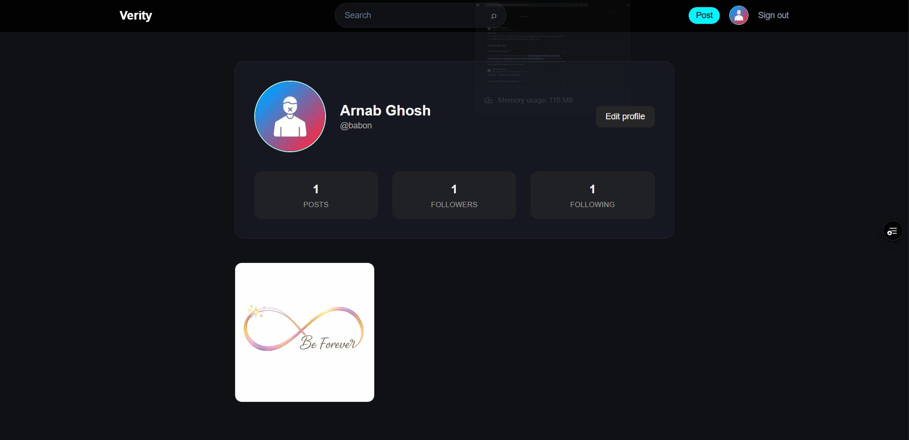
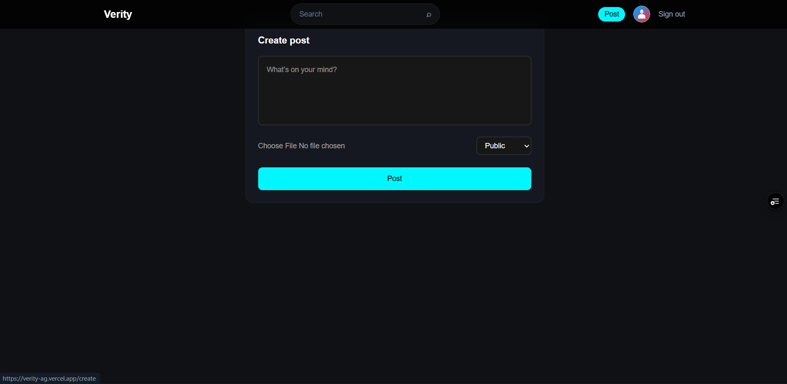
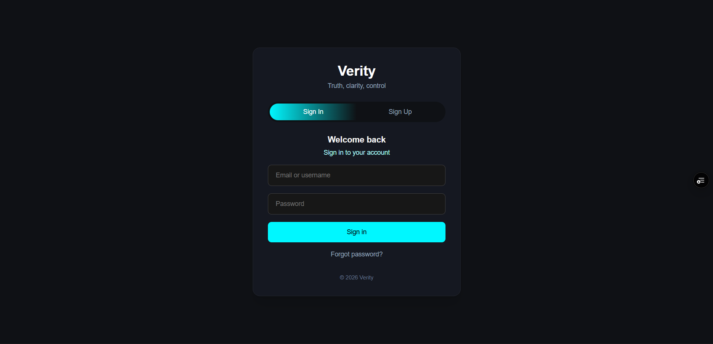
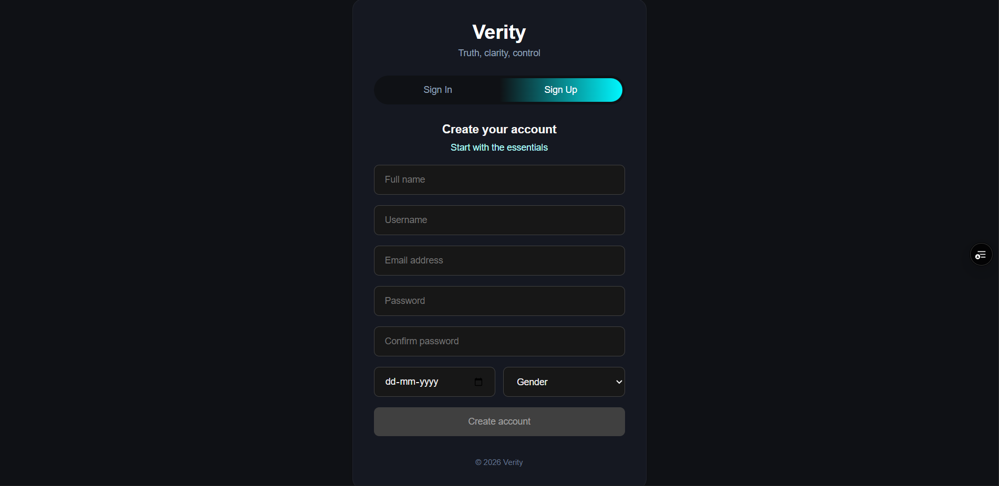

# Verity — Social Media Platform (Next.js)

Verity is a modern social media platform built with **Next.js App Router**, featuring authentication, profiles, follow system, posts with media uploads, and a personalized feed with privacy controls.

🚀 **Live Demo:** https://verity-ag.vercel.app/  
📦 **Repository:** https://github.com/Babon3112/verity

---

## ✨ Features

### ✅ Authentication & Security
- Sign Up with Email Verification (OTP)
- Sign In using **Username or Email**
- Forgot Password + Reset Password (OTP-based)
- JWT Sessions via **NextAuth Credentials Provider**

### ✅ Social Features
- User Profiles (avatar, bio, counts)
- Follow / Unfollow system
- Follow status checking
- Personalized Home Feed

### ✅ Posts & Media
- Create post with:
  - Text content
  - Image / Video uploads
  - Visibility controls: **public / followers / private**
- Cloudinary media upload (Image optimized using Sharp)
- Soft delete support (ready for future expansion)

### ✅ Feed Logic
Feed shows posts based on visibility rules:
- **Public posts** → visible to all authenticated users
- **Followers-only posts** → visible only to followers
- **Private posts** → visible only to author

---

## 🧱 Tech Stack

**Frontend**
- Next.js 16 (App Router)
- React + TypeScript
- Tailwind CSS

**Backend**
- Next.js Route Handlers (API)
- MongoDB + Mongoose

**Auth**
- NextAuth (Credentials Provider)
- bcrypt password hashing

**Media**
- Cloudinary
- Sharp (image optimization)

**Email**
- Nodemailer + Gmail OAuth2

**Hosting**
- Vercel

---

## 📌 API Routes (Highlights)

- `POST /api/signup` → Register + send verification OTP  
- `POST /api/verify` → Verify user OTP  
- `POST /api/auth/[...nextauth]` → NextAuth credentials login  
- `POST /api/forgot-password` → Send reset OTP  
- `POST /api/reset-password` → Reset password using OTP  
- `POST /api/posts/create` → Create a post (supports media)  
- `GET /api/feed` → Home feed based on follow + visibility rules  
- `POST /api/follow` → Follow/Unfollow toggle  
- `GET /api/profile?username=` → Get user profile  
- `GET /api/posts/all-posts?username=` → Fetch user posts  

---

## ⚙️ Environment Variables

Create a `.env.local` file in the root:

```env
# MongoDB
MONGODB_URI=YOUR_MONGODB_URI

# NextAuth
NEXTAUTH_SECRET_KEY=YOUR_SECRET

# Cloudinary
CLOUDINARY_CLOUD_NAME=YOUR_NAME
CLOUDINARY_API_KEY=YOUR_KEY
CLOUDINARY_API_SECRET=YOUR_SECRET

# Email (Gmail OAuth2)
CLIENT_ID=YOUR_GOOGLE_CLIENT_ID
CLIENT_SECRET=YOUR_GOOGLE_CLIENT_SECRET
REDIRECT_URI=YOUR_GOOGLE_REDIRECT_URI
REFRESH_TOKEN=YOUR_GOOGLE_REFRESH_TOKEN
```

## 🛠️ Installation & Run Locally
git clone https://github.com/Babon3112/verity
cd verity
npm install
npm run dev

## App runs at:

http://localhost:3000

## Screenshots







## 🤝 Feedback & Suggestions

Verity is still under development, and feedback is welcome.

If you have suggestions or want to contribute:

Open an Issue on GitHub: https://github.com/Babon3112/verity/issues

Or connect with me on LinkedIn

⭐ If you like this project, feel free to star the repo!